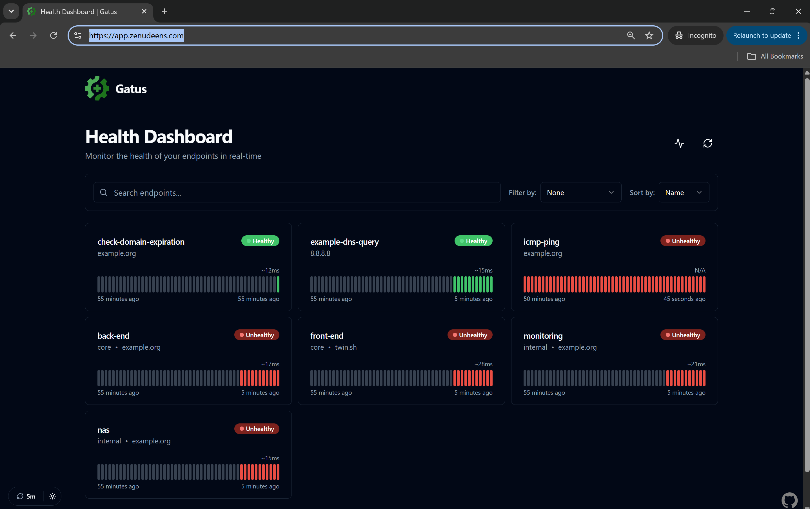
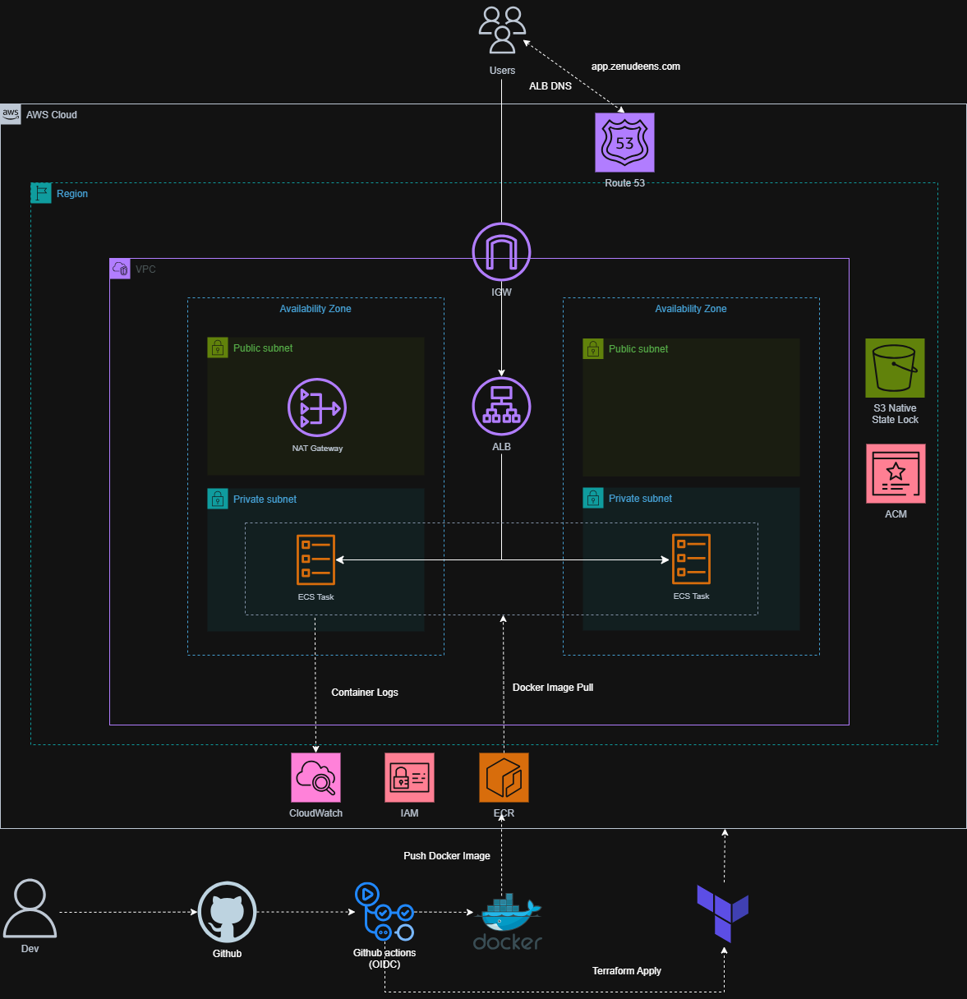
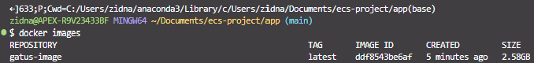
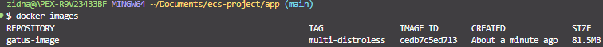
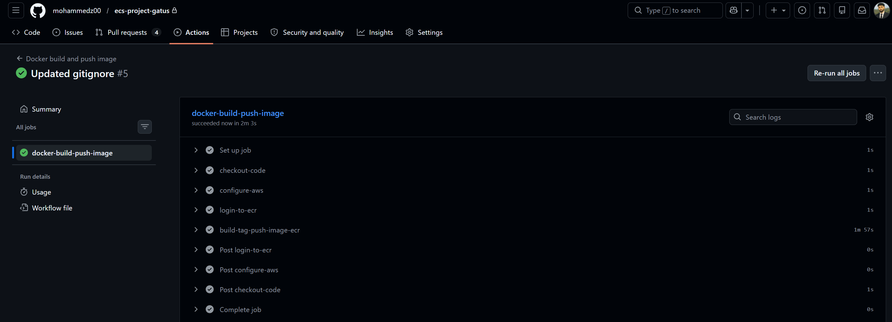
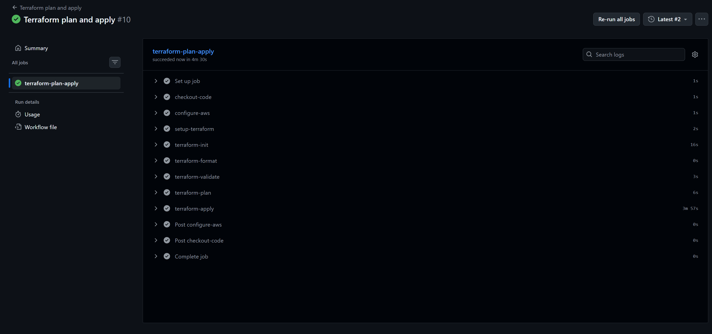
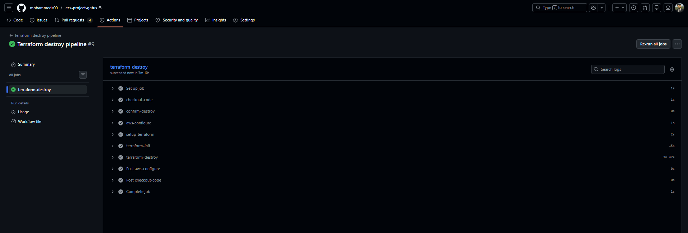

# End to end deployment of Gatus Health Monitoring App


A production-grade deployment of [Gatus](https://github.com/TwiN/gatus), an open-source automated health monitoring dashboard written in Go. Gatus continuously checks configured endpoints on a schedule, evaluates conditions against the responses, and displays results on a real-time dashboard — alerting you when something goes down.

This project deploys Gatus on AWS ECS Fargate with full infrastructure as code, HTTPS via a custom domain, and three automated CI/CD pipelines using keyless OIDC authentication.

---

## Overview

This project demonstrates an end-to-end DevOps workflow built entirely from scratch:

- **Containerisation**: multi-stage Dockerfile using a `scratch` base image, reducing image size from 2.6GB to 80MB (a 97% reduction), with a non-root user for security
- **Infrastructure as Code**: fully modularised Terraform across 6 modules with S3 native state locking
- **Security**: OIDC authentication between GitHub Actions and AWS, no static credentials stored anywhere, non-root container user, minimal attack surface via scratch image
- **Networking**: VPC with public/private subnet separation, NAT Gateway, ALB with HTTP-to-HTTPS redirect
- **TLS**:automated certificate provisioning and DNS validation via ACM and Route53
- **CI/CD**:three separate GitHub Actions pipelines with Trivy image scanning, tflint linting, and post-deploy health checks



---

## Architecture



**Traffic flow:**
```
User → Route53 (app.zenudeens.com) → ALB (public subnets)
     → HTTP:80 redirects to HTTPS:443
     → HTTPS:443 forwards to ECS tasks (private subnets, port 8080)
     → ECS pulls images from ECR via Regional NAT Gateway
```

---

## Repository Structure

```
ECS-PROJECT/
├── .github/
│   └── workflows/
│       ├── docker-build-push.yaml       # Build, scan, and push Docker image to ECR
│       ├── terraform-destroy.yaml       # Manual destroy with confirmation gate
│       └── terraform-plan-apply.yaml    # Lint, plan, apply, health check
├── app/                                 # Gatus application and config
├── assets/                              # Project assets and screenshots
├── infra/
│   ├── bootstrap/                       # One-time setup: S3 state, ECR, OIDC
│   │   ├── main.tf
│   │   └── provider.tf
│   ├── modules/
│   │   ├── acm/                         # ACM certificate and DNS validation
│   │   ├── alb/                         # ALB, listeners, target group, HTTP redirect
│   │   ├── ecs/                         # ECS cluster, task definition, service, IAM
│   │   ├── route53/                     # Hosted zone and DNS records
│   │   ├── sg/                          # Security groups for ALB and ECS
│   │   └── vpc/                         # VPC, subnets, IGW, NAT Gateway, route tables
│   ├── .terraform.lock.hcl              # Provider version lock file
│   ├── backend.tf                       # S3 remote state configuration
│   ├── main.tf                          # Root module — wires all modules together
│   ├── provider.tf                      # AWS provider configuration
│   ├── terraform.tfvars                 # Variable values
│   └── variables.tf                     # Root variable declarations
├── .gitignore
├── Dockerfile                           # Multi-stage scratch-based build
├── LICENSE
└── README.md
```

---

## What is Gatus?

Gatus is a lightweight, open-source health monitoring tool written in Go. It is configured entirely via a single `config.yaml` file that defines endpoints to monitor, check intervals, and conditions to evaluate. Conditions can check HTTP status codes, response body content, response time, TLS certificate expiration, domain expiration, DNS resolution, and ICMP connectivity.

Gatus runs as a single static binary with no external runtime dependencies, making it an ideal candidate for a scratch Docker image. It serves a real-time dashboard on port 8080 and exposes a `/health` endpoint returning `{"status":"UP"}`.

---

## Docker

### Multi-Stage Build

The Dockerfile uses a two-stage build:

**Build stage** (`golang:alpine`)
- Copies `go.mod` and `go.sum` first to leverage Docker layer caching — dependency downloads are skipped on rebuilds unless dependencies change
- Compiles the Gatus binary with `CGO_ENABLED=0` (fully static, no C library dependencies) and `GOOS=linux` (cross-compile for Linux regardless of build machine OS)
- Creates a non-root user (`appuser`) in the build stage

**Runtime stage** (`scratch`)
- Completely empty base image — no OS, no shell, no package manager
- Copies only the compiled binary, the Gatus config file, and `/etc/passwd` and `/etc/group` from the build stage
- `/etc/passwd` is required because the scratch image has no user database — without it the container runtime cannot resolve `appuser` and fails to start
- Sets `GATUS_CONFIG_FILE` environment variable to point to the config location
- Runs as `appuser` — not root

### Image Size

Single Stage Image Size


Multi Stage Image Size


| Approach | Image Size |
|----------|-----------|
| Single-stage (ubuntu base) | 2.6GB |
| Multi-stage (scratch base) | 80MB |
| **Reduction** | **97%** |

The smaller image means faster ECR pulls, reduced attack surface, and no unnecessary OS utilities available if the container is compromised.

---

## Infrastructure

All infrastructure is deployed in **eu-west-1 (Ireland)** and managed via Terraform with S3 native state locking.

### Networking (vpc module)

- VPC with CIDR `10.0.0.0/16`
- 2 public subnets (`eu-west-1a`, `eu-west-1b`) — hosts the ALB and NAT Gateway
- 2 private subnets (`eu-west-1a`, `eu-west-1b`) — hosts ECS tasks
- Internet Gateway for public subnet outbound traffic
- Nat Gateway — provides outbound internet access for private subnet resources (ECS pulling images from ECR, Gatus checking external endpoints)
- Public route table: `0.0.0.0/0` → Internet Gateway
- Private route table: `0.0.0.0/0` → NAT Gateway

### Security Groups (sg module)

- **ALB SG**: inbound HTTP (80) and HTTPS (443) from `0.0.0.0/0`, all outbound
- **Container SG**: inbound port 8080 from ALB SG only, all outbound. ECS tasks are never directly reachable from the internet.

### Load Balancer (alb module)

- Application Load Balancer spanning both public subnets
- **HTTP listener (port 80)** → 301 redirect to HTTPS. Forces all traffic onto TLS.
- **HTTPS listener (port 443)** → forwards to ECS target group
- Target group: IP mode, port 8080, health check on `/health`

### ECS (ecs module)

- Fargate cluster with Container Insights enabled (CloudWatch metrics)
- Single task running Gatus (0.5 vCPU, 1GB memory)
- Tasks deployed in private subnets, no public IP assigned
- IAM task execution role with `AmazonECSTaskExecutionRolePolicy`
- Image pulled from ECR tagged as `:latest`

### TLS and DNS (acm + route53 modules)

- Route53 hosted zone for `app.zenudeens.com`
- ACM certificate for `app.zenudeens.com` with automated DNS validation — Terraform creates the validation CNAME record in Route53 and waits for issuance before proceeding
- A record alias pointing `app.zenudeens.com` to the ALB


## Bootstrap

Before the main Terraform configuration or any CI/CD pipeline can run, a small set of prerequisite resources must exist. These live in `infra/bootstrap/` and are applied manually, once, from a local machine.

The bootstrap configuration creates:

- **S3 bucket**: remote backend for Terraform state, with native state locking (Terraform 1.10+, no DynamoDB table required)
- **ECR repository** (`zenudeen-gatus-ecr`): required before any image can be pushed or before ECS can reference an image in the main Terraform configuration
- **OIDC identity provider**: registers GitHub Actions (`token.actions.githubusercontent.com`) as a trusted identity provider in AWS
- **IAM role**: scoped via trust policy to this specific GitHub repository only, assumed by GitHub Actions at runtime to obtain short-lived credentials

This separation exists because of a bootstrapping problem: the main infrastructure and CI/CD pipelines depend on these resources existing first. The pipelines cannot create the very credentials and registry they need to run. Bootstrap breaks that circular dependency by being applied manually, outside the automated pipeline, before anything else.

```bash
cd infra/bootstrap
terraform init
terraform apply -auto-approve
```

Bootstrap only needs to be run once per AWS account. After this, the IAM role ARN output should be copied into the `AWS_ROLE_ARN` GitHub Actions secret, and all subsequent infrastructure changes flow through the automated pipelines.

---

## CI/CD Pipelines

All three pipelines authenticate to AWS using **OIDC**. GitHub Actions requests a signed JWT token, presents it to AWS STS, and receives temporary credentials scoped to the IAM role. Credentials expire after the job completes.

### Pipeline 1: Docker Build and Push



**Trigger:** Push to `main` when `app/` or `Dockerfile` changes

| Step | Description |
|------|-------------|
| Checkout code | Check out repository |
| Configure AWS (OIDC) | Assume IAM role via OIDC |
| Login to ECR | Authenticate Docker with ECR |
| Build image | Multi-stage build, tagged with commit SHA and `latest` |
| Trivy scan | Scan image for vulnerabilities — fails pipeline on CRITICAL findings |
| Push to ECR | Push both SHA and `latest` tags to `zenudeen-gatus-ecr` |


### Pipeline 2: Terraform Plan and Apply



**Trigger:** Push to `main` when `infra/` changes, or manual `workflow_dispatch`

| Step | Description |
|------|-------------|
| Checkout code | Check out repository |
| tflint | Lint Terraform files — catches misconfigurations before planning |
| Configure AWS (OIDC) | Assume IAM role via OIDC |
| Setup Terraform | Install Terraform on the runner |
| terraform init | Initialise with S3 remote backend |
| terraform fmt -check | Fail if files are not formatted correctly |
| terraform validate | Validate configuration syntax |
| terraform plan | Show planned changes |
| terraform apply | Apply changes with `-auto-approve` |
| Health check | Curl `https://app.zenudeens.com/health` — fail pipeline if not 200 |

### Pipeline 3: Terraform Destroy



**Trigger:** Manual `workflow_dispatch` only, never runs automatically

Presents a confirmation dropdown before any AWS resources are touched. If "Destroy infrastructure" is not explicitly selected the pipeline exits immediately. Prevents accidental destruction.

| Step | Description |
|------|-------------|
| Checkout code | Check out repository |
| Confirm destroy | Exit 1 if confirmation input is not "Destroy infrastructure" |
| Configure AWS (OIDC) | Assume IAM role via OIDC |
| Setup Terraform | Install Terraform on the runner |
| terraform init | Initialise with S3 remote backend |
| terraform destroy | Destroy all managed resources with `-auto-approve` |

---

## Cost Analysis

Infrastructure is destroyed after use, so ongoing costs are negligible. The table below shows the estimated cost of running this stack continuously for one month in `eu-west-1`.

| Service | Details | Monthly Cost (est.) |
|---------|---------|-------------------|
| ECS Fargate | 0.5 vCPU, 1GB, 1 task, 730hrs | ~$15.00 |
| ALB | 1 load balancer, low traffic | ~$18.00 |
| Regional NAT Gateway | $0.045/hr per AZ + $0.045/GB processed | ~$33.00 base |
| ECR | 80MB image storage | ~$0.01 |
| Route53 | 1 hosted zone + queries | ~$0.50 |
| CloudWatch | Container Insights metrics | ~$3.00 |
| ACM | TLS certificate | Free |
| S3 | Terraform state storage | ~$0.01 |
| **Total** | | **~$70/month** |

---

## First-Time Setup

### Prerequisites

- AWS account
- Terraform installed locally
- AWS CLI configured locally
- Docker installed locally
- Domain registered (this project uses Cloudflare for the root domain with NS delegation to Route53 for the subdomain)
- GitHub repository

### Step 1: Bootstrap

Bootstrap creates the S3 state bucket, ECR repository, and OIDC infrastructure. Run once manually from your local machine:

```bash
cd infra/bootstrap
terraform init
terraform apply -auto-approve
```

This creates:
- S3 bucket for Terraform remote state with native state locking
- ECR repository (`zenudeen-gatus-ecr`)
- GitHub Actions OIDC identity provider
- IAM role for GitHub Actions

### Step 2: Configure GitHub Secret

After bootstrap, copy the IAM role ARN from the Terraform output and add it as a GitHub Actions secret:

Go to: **GitHub repo → Settings → Secrets and variables → Actions → New repository secret**

| Secret | Value |
|--------|-------|
| `AWS_ROLE_ARN` | ARN of the OIDC IAM role from bootstrap output |

### Step 3: Push Initial Docker Image

An image must exist in ECR before Terraform deploys ECS. Build and push once manually:

```bash
# Authenticate Docker with ECR
aws ecr get-login-password --region eu-west-1 | docker login --username AWS --password-stdin <account-id>.dkr.ecr.eu-west-1.amazonaws.com

# Build and push
docker build -t zenudeen-gatus-ecr .
docker tag zenudeen-gatus-ecr:latest <account-id>.dkr.ecr.eu-west-1.amazonaws.com/zenudeen-gatus-ecr:latest
docker push <account-id>.dkr.ecr.eu-west-1.amazonaws.com/zenudeen-gatus-ecr:latest
```

### Step 4: Configure DNS Delegation

In Cloudflare, add NS records for `app.zenudeens.com` pointing to the four Route53 nameservers shown in your hosted zone. This delegates the subdomain to Route53 so ACM validation and A records resolve correctly.

### Step 5: Deploy Infrastructure

Trigger Pipeline 2 manually via `workflow_dispatch`, or push a change to `infra/`:

```bash
git push origin main
```

### Step 6: Verify

```bash
curl -s https://app.zenudeens.com/health
# {"status":"UP"}
```

---

## Known Improvements

- **Least-privilege IAM**: the GitHub Actions role uses `AdministratorAccess` for simplicity. A production setup would scope permissions to only the specific AWS actions Terraform requires.
- **Image tag pinning**: ECS always pulls `:latest`. A more robust approach would use SSM Parameter Store to pass the exact commit SHA from the Docker pipeline to Terraform, ensuring ECS always runs the exact image built in that pipeline run.
- **Gatus persistence**: Gatus stores monitoring history in memory by default. History is lost on container restart. A database backend (PostgreSQL or SQLite on EFS) would persist history across deployments.
- **Multi-AZ NAT**: the Regional NAT Gateway provides flexibility but still incurs per-AZ charges. For a low-traffic project, a single zonal NAT gateway would be cheaper. For high-availability production, one NAT gateway per AZ is the standard pattern.

---

## Tech Stack

| Tool | Purpose |
|------|---------|
| Gatus | Health monitoring application |
| Go | Application language (static binary compilation) |
| Docker | Multi-stage scratch-based containerisation |
| AWS ECS Fargate | Serverless container orchestration |
| AWS ALB | Load balancing, HTTPS termination, HTTP redirect |
| AWS ACM | Automated TLS certificate provisioning |
| AWS Route53 | DNS management and ACM validation |
| AWS ECR | Container image registry |
| AWS IAM | OIDC identity provider and role-based access |
| Terraform | Modularised infrastructure as code |
| GitHub Actions | CI/CD pipelines |
| OIDC | Keyless AWS authentication — no static credentials |
| Trivy | Container image vulnerability scanning |
| tflint | Terraform linting and misconfiguration detection |
